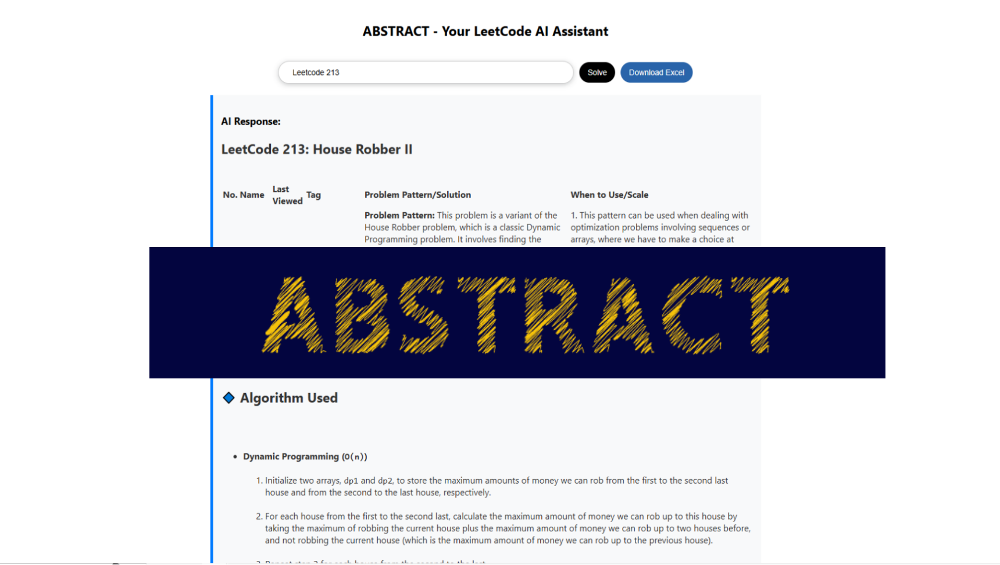

# Abstract-LeetCode

ABSTRACT is an intelligent study and review tool designed specifically for mastering LeetCode questions. It helps users organize, summarize, and retain key problem-solving patterns efficiently. With structured note-taking, spaced repetition, and AI-powered insights, ABSTRACT makes coding interview preparation faster and more effective.
* Contributor: [Jonas Li](yunzhe-li.top)

## Version
### v1.0 Feb 20, 2025
Features:
* Enter one question, abstracts generate the structured question analysis including the question patterns, complexity analysis, and code for the exact best solution.
* Download the question analysis sheet to local for further review.

Demo Video: 
* https://youtu.be/IpndzIX_nuw?si=6n_jJ6v2kG5yGaRp

### v1.1 In progress
What to expect:
* View the solved or saved questions on the site.
* View the recent reviewed dates and the recommended questions for review based on memory lost curve.
* Add the question link for every record.
    